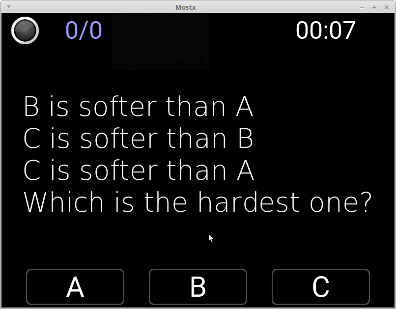
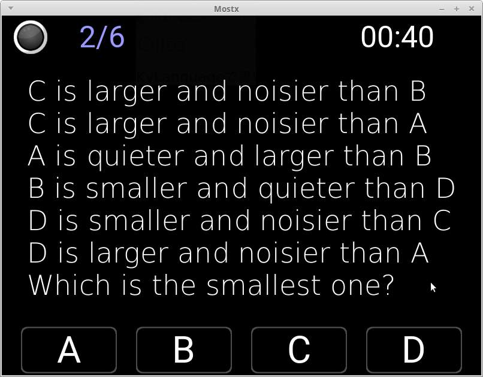
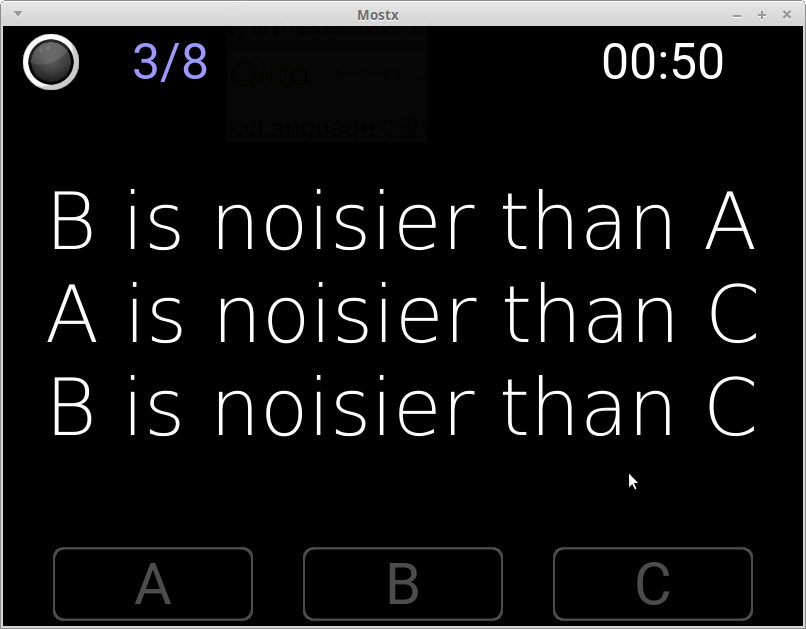
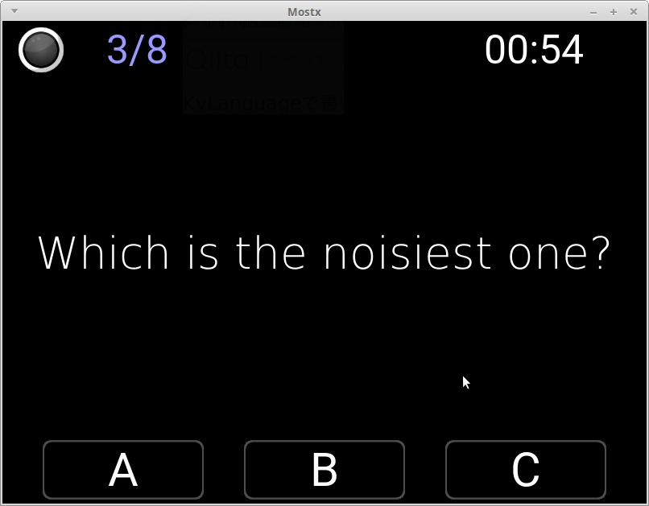

BはAより大きい  
AはCより小さい  
BはCより小さい  
最も小さいのは?  

といった感じのQuizをドンドン出題してくるApplicationです。  
日本語,繁體中國語,韓國語,英語に対応してます。

### Test環境(Test Environment)

- Python 3.5.0 + Kivy 1.10.0  

### その他  

Google Play Storeでも公開しています  
https://play.google.com/store/apps/details?id=jp.gottadiveintopython.mostx